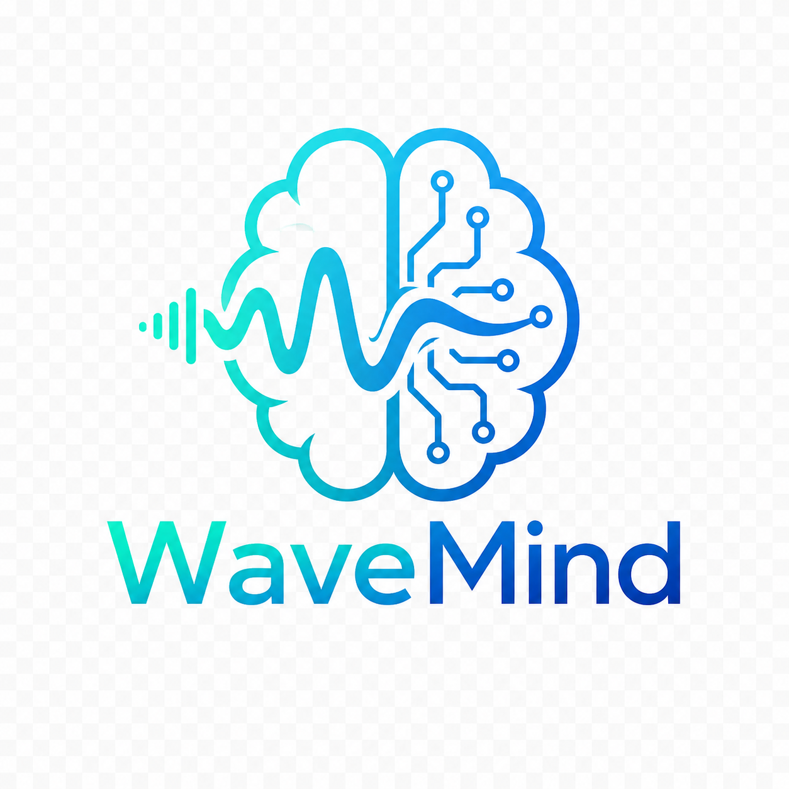
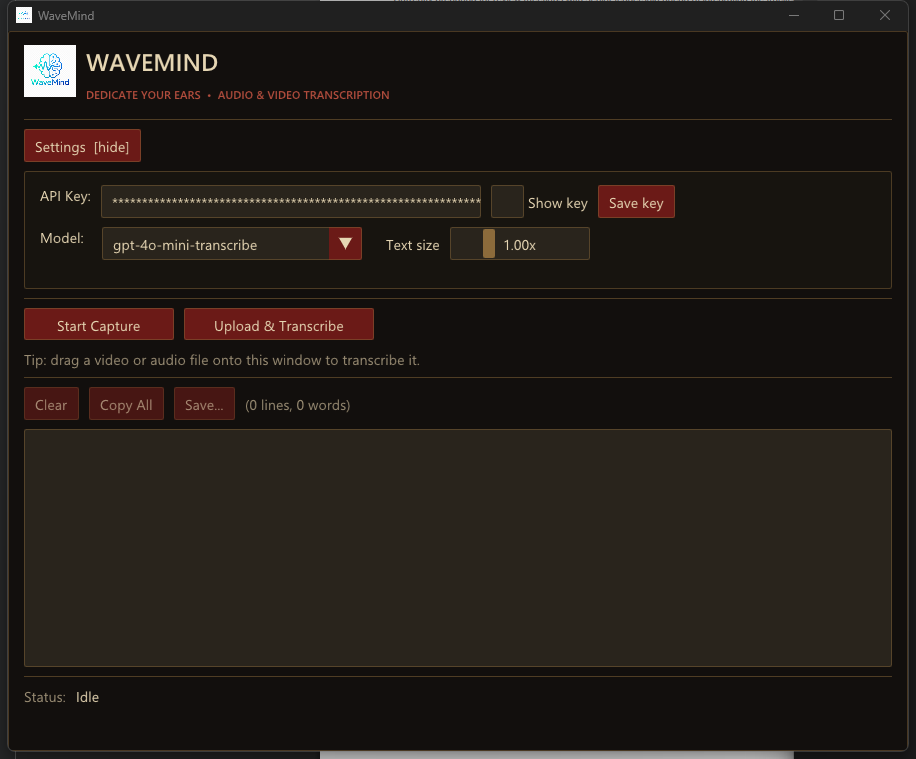
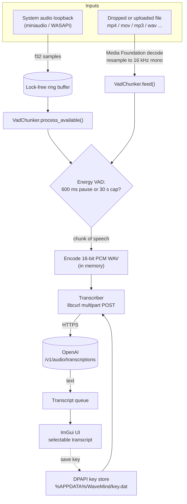
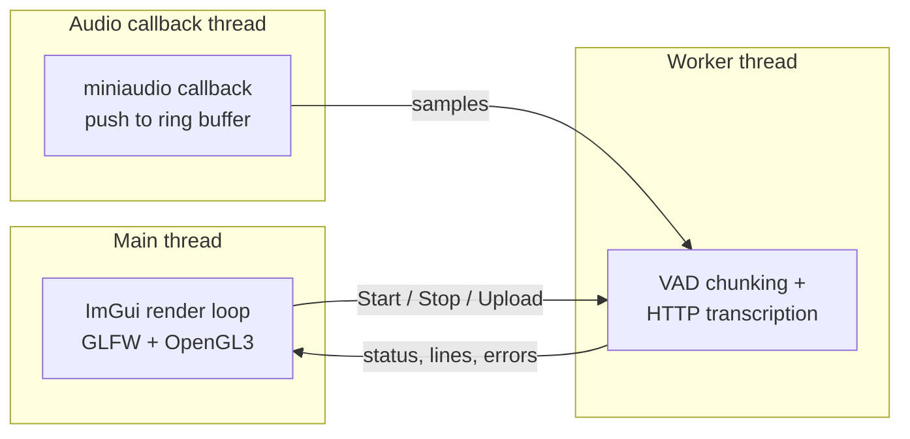

<div align="center">
  
  <h1>WaveMind</h1>
  <p><b>WAVEMIND &bull; DEDICATE YOUR EARS</b></p>
  <p>A wee Windows desktop app that listens to whatever your PC is playing, or to any video/audio file you throw at it, and turns it into a live transcript using the OpenAI API.</p>
</div>

<p align="center">
  
</p>

---

## What it is

I wanted something dead simple: hit a button and get a transcript of whatever sound my computer is making, whether that's a meeting, a YouTube video, a podcast, or a film. No browser tabs, no uploading my files to some random website, no faffing about with command line tools. Just a single .exe that captures system audio (or opens a file), transcribes it, and shows the text so I can read along and copy bits out.

It is written almost entirely in modern C++ (C++23). The only "asset" generation I did outside of C++ was a one-off PowerShell script to build the app icon from the logo. Everything that runs at runtime is native code, so it stays a single self-contained executable with no DLLs to ship and nothing to install on the target machine.

## What it can do

- **Live system audio capture.** It grabs whatever is coming out of your speakers (WASAPI loopback) and transcribes it in near real time.
- **Upload any video or audio file.** Drop an mp4, mov, mkv, mp3, m4a, wav, flac and so on onto the window, or use the Upload button. It pulls the audio track out and transcribes the whole thing.
- **Drag and drop.** Just drag a file onto the window and it gets going.
- **Pick your model.** Choose between `gpt-4o-mini-transcribe`, `gpt-4o-transcribe` and `whisper-1`.
- **Your API key stays yours.** The key is encrypted with Windows DPAPI and saved under your user account, so it is prefilled next time and never sits on disk in plain text.
- **Select and copy.** The transcript is fully selectable, so you can click and drag to highlight just the bit you want and copy it, or grab the lot with Copy All, or save it to a text file.
- **It looks the part.** Dark Survey Corps styled theme (think Attack on Titan: blood red, bronze, parchment), the WaveMind logo baked into the app and the taskbar icon, and a matching dark title bar.
- **Handy extras.** A text size slider, a live recording timer, and a running line and word count.

## How it works under the hood

The core idea is that both input sources (live capture and files) end up feeding the exact same pipeline. Audio comes in as 16 kHz mono float samples, a simple energy based voice activity detector (VAD) cuts it into sensible chunks at natural pauses, each chunk gets encoded to a small WAV in memory, and that WAV is posted to OpenAI. The text that comes back is pushed onto a queue that the UI reads.



A couple of things I am quietly proud of:

- The VAD keeps **all** of the audio for a chunk. An earlier version analysed each frame and then threw the samples away, which meant it was uploading near silence. Now it keeps every sample and only advances an analysis cursor, so the chunk you send is the chunk you actually heard.
- File transcription reuses the live pipeline completely. The Media Foundation decoder just calls `VadChunker::feed()` with decoded samples, so there is no duplicate chunking or HTTP code.
- Decoding files uses **Media Foundation**, which is already part of Windows. That means no bundled ffmpeg, no extra binaries, and it works with whatever codecs the machine already has.

### Threading

The UI never blocks. The audio callback only ever pushes samples into a lock free ring buffer (it never allocates or does any I/O). A single worker thread does the VAD and the network calls. Everything shared between threads goes through small mutex or atomic guarded helpers in `AppState`.



Stopping is non blocking too. When you hit Stop, the UI flips a flag and the device stops, then the worker is reaped on a later frame so the window never freezes. On a clean app close, any in flight upload is aborted quickly through a libcurl progress callback.

## Tech stack

| Concern | What I used |
| --- | --- |
| Language | C++23 (`std::expected` as the result type) |
| Build | CMake + MSVC, dependencies via vcpkg (`x64-windows-static`) |
| GUI | Dear ImGui with the GLFW + OpenGL3 backends |
| Audio capture | miniaudio (WASAPI loopback) |
| File decoding | Windows Media Foundation (Source Reader) |
| HTTP | libcurl (`curl_mime` multipart) |
| JSON | nlohmann-json |
| Image loading | stb_image (for the embedded logo) |
| Key storage | Windows DPAPI (`CryptProtectData` / `CryptUnprotectData`) |

Everything is statically linked into one `WaveMind.exe` whose only dependencies are standard Windows system DLLs.

## Project structure

```
src/
  main.cpp           App entry, GLFW + OpenGL3 + ImGui render loop, all the UI and theming
  app_state.h        Shared thread-safe state (ring buffer, transcript queue, status)
  audio_capture.*    miniaudio loopback device
  vad_chunker.*      Energy based VAD that emits chunks at pauses
  wav.*              Encode f32 PCM to in-memory 16-bit PCM WAV
  transcriber.*      libcurl multipart POST to OpenAI, returns std::expected
  media_decoder.*    Media Foundation: decode any media file to 16 kHz mono
  image_loader.*     stb_image wrapper, loads the embedded logo
  key_store.*        DPAPI save/load of the API key
  resource.h         Resource IDs
assets/
  wavemindlogo.png   The full logo
  logo_embed.png     256px logo embedded into the exe
  app_icon.ico       Multi-size icon for the exe and taskbar
resource.rc          Embeds the icon and logo into the executable
CMakeLists.txt
CMakePresets.json
vcpkg.json           Pinned dependencies (with a builtin-baseline)
BUILD.md             Full build notes
```

## Building it

You need Visual Studio 2022 (or the Build Tools) with the C++ workload, CMake 3.25+, and a git clone of vcpkg.

```powershell
# one-time vcpkg setup
git clone https://github.com/microsoft/vcpkg C:\dev\vcpkg
C:\dev\vcpkg\bootstrap-vcpkg.bat
$env:VCPKG_ROOT = "C:\dev\vcpkg"

# configure and build (deps install automatically from vcpkg.json)
cd C:\dev\WaveMind
cmake --preset windows-msvc-release
cmake --build --preset release
```

The result is `build/release/Release/WaveMind.exe`. There is more detail in [BUILD.md](BUILD.md), including the one gotcha (the vcpkg bundled inside Visual Studio is not a git repo, so use a real clone).

## Using it

1. Launch the app. The settings panel slides open.
2. Paste your OpenAI API key and hit Save key. It gets encrypted and remembered.
3. Pick a model.
4. Either hit **Start Capture** and play some audio, or **Upload & Transcribe** a file (or just drag a file onto the window).
5. Watch the transcript fill in. Drag to select any part, Copy All, or Save it to a file.

## A few honest notes

- It is Windows only by design (WASAPI loopback, DPAPI, Media Foundation are all Windows APIs).
- File decoding leans on the codecs already installed on the machine. Common stuff (mp4 with AAC, mp3, wav, m4a, wmv) works out of the box on Windows 10/11.
- You bring your own OpenAI API key, and transcription calls go to OpenAI, so usage is billed to your account.
- The VAD is deliberately simple. It cuts on roughly 600 ms of quiet or a 30 second cap, and it carries a little context between chunks so sentences flow across boundaries.

## Acknowledgements

Claude (Anthropic) helped scaffold the project and talk through some of the Windows plumbing. The direction, decisions and final code are mine.

## License

MIT. See [LICENSE](LICENSE).
